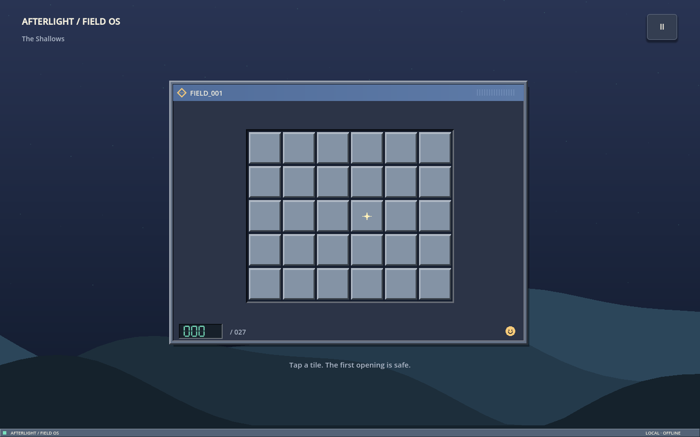
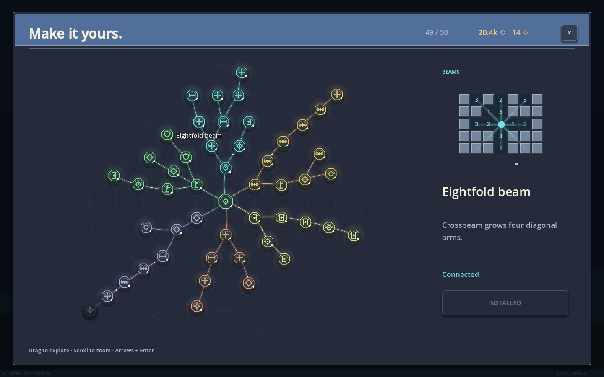

# Afterlight

A complete solo Minesweeper expedition built with Godot 4.7.2 and the Compatibility renderer. Read the ground, collect light, and build a fleet that learns to work beside you.



## Play

On this checkout, launch `builds/windows/Afterlight.exe`. Keep `Afterlight.pck` beside it. The standalone release needs no Godot installation.

From source, set `GODOT_EXE` in your environment or `.env.local` (see `.env.example`), then:

```powershell
powershell -File tools/run.ps1 -Mode play
```

## The expedition

- Six regions, 96 excavation sites with 628 strata, twelve mastery trials, a final ending and endless exploration.
- Fifty discoveries in a branching upgrade tree: shaped beams, excavation drills, chain reactions, pattern recognition, oracle probes, and a fleet growing from one drone to eight.
- Mistakes reduce the field rating but preserve earnings and progress. A rechargeable safe probe resolves uncertainty.
- Main menu, pause, settings, automatic saves with verified backup recovery, field guide, atlas, records and local screenshot reports.
- Entirely procedural artwork and audio. Six region scores are baked from the included oscillator synthesis code; no generative image/audio service or third-party media assets were used.

The campaign is tuned toward roughly three hours for fast play, before optional mastery trials. One-second simulated decision policies take 173–176 minutes; a three-second policy takes 344 minutes. These are synthetic policies, not measured human sessions. See `docs/QA.md` for what was tested and its limits.

The opening exposes one small field. Controls and systems unfold as you play. Descriptions live in hover help and the separate Grow map; upgrade demonstrations show what equipment does.



## Controls

| Action | Input |
|---|---|
| Reveal a tile / chord an open number | Left click |
| Place or remove a flag | Right click |
| Select a board tile | Arrow keys |
| Reveal selected tile | Enter / Space |
| Flag selected tile; otherwise toggle flag mode | F |
| Guaranteed safe Pulse | 1; Space without a selected tile. Aim after Focused pulse. |
| Open the discovery tree | Tab / Grow |
| Descend after clearing a stratum | Enter / Descend |
| Crossbeam / Horizon / Nova | 2 / 3 / 4, then choose a tile |
| Solar overdrive | 5 |
| Cancel aiming / pause / close panel | Esc |
| Field guide | F1 |
| Save a local screenshot report | F10 |
| Fullscreen | F11 |

The first reveal is safe. Numbers count charges in all eight neighbouring tiles. Match a number with flags, then click it to chord. Wrong flags can cause strikes; drones only trust proven deductions.

## Saves and settings

Windows save location: `%APPDATA%/Godot/app_userdata/Afterlight/`. The primary save and its verified backup store the exact field, remaining plating, stratum, equipment, tools, trial and completion state. Version 1.0 saves migrate without resetting the current field. Settings save immediately. Reports stay under `reports/` in this directory and are never uploaded automatically.

Tests use separate paths inside `test_runs/` and do not access player data.

## Build and validate

```powershell
powershell -File tools/bootstrap.ps1
powershell -File tools/run.ps1 -Mode shots
powershell -File tools/run.ps1 -Mode balance
powershell -File tools/run.ps1 -Mode power
powershell -File tools/export.ps1
```

The Windows export uses an installed 4.7.2 template. A single-threaded Compatibility Web preset is also supplied (`tools/export.ps1 -Target Web`). No store APIs, network services, accounts, telemetry or monetisation are present.

`AGENTS.md` describes the project conventions. `docs/DESIGN.md` records design and research. `docs/QA.md` gives verification results. The inherited project process notes remain in `process_distillation/`.

## Asset provenance

Artwork lives in `game/ui/scenery.gd`, `board_view.gd`, `palette.gd`, `effects.gd`, and `assets/icon.svg`. Audio synthesis lives in `game/audio.gd`; `tools/bake_audio.gd` reproducibly creates the six WAV files. Engine and bundled-library notices are accessible through the in-game Credits screen.
